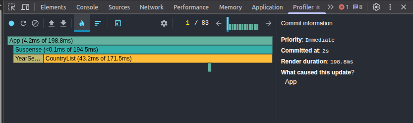
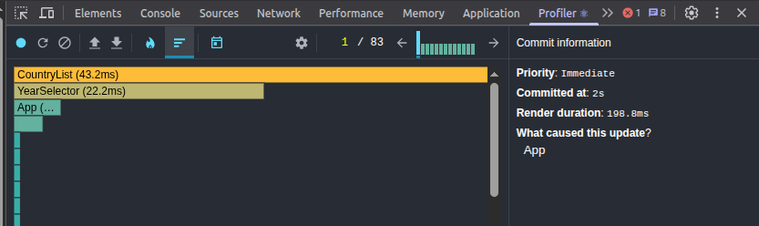
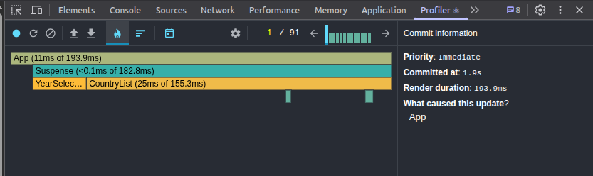
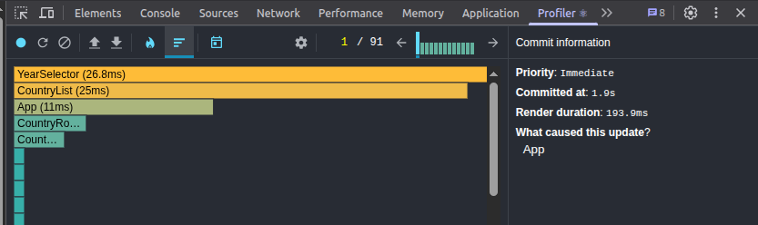

## ⚡ Performance Profiling

We used the **React DevTools Profiler** to measure app performance.

### Interactions Tested

- Searching for a country
- Changing the year
- Changing sort order
- Adding/removing columns

### Results

#### 1. Initial Profiling with React Dev Tools Profiler

- **Commit Duration:** ~2ms on average for most interactions
- **Render Duration:**
  - `CountryList` and children: ~43.2ms per commit
  - UI controls (`YearSelector`, `SearchInput`): negligible (<1ms)

### Screenshots

#### 2. Updated App with React.memo and useMemo

- **Commit Duration:** ~3.3ms on average for most interactions
- **Render Duration:**
  - `CountryList` and children: ~25ms per commit
  - UI controls (`YearSelector`, `SearchInput`): negligible (<1ms)

### Screenshots

### Conclusion

The app performs efficiently even when searching, sorting, or changing years.  
React optimizations (`useMemo`, `useCallback`, `React.memo`) successfully reduced unnecessary re-renders.
